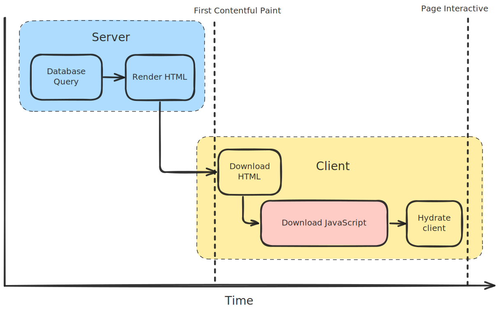
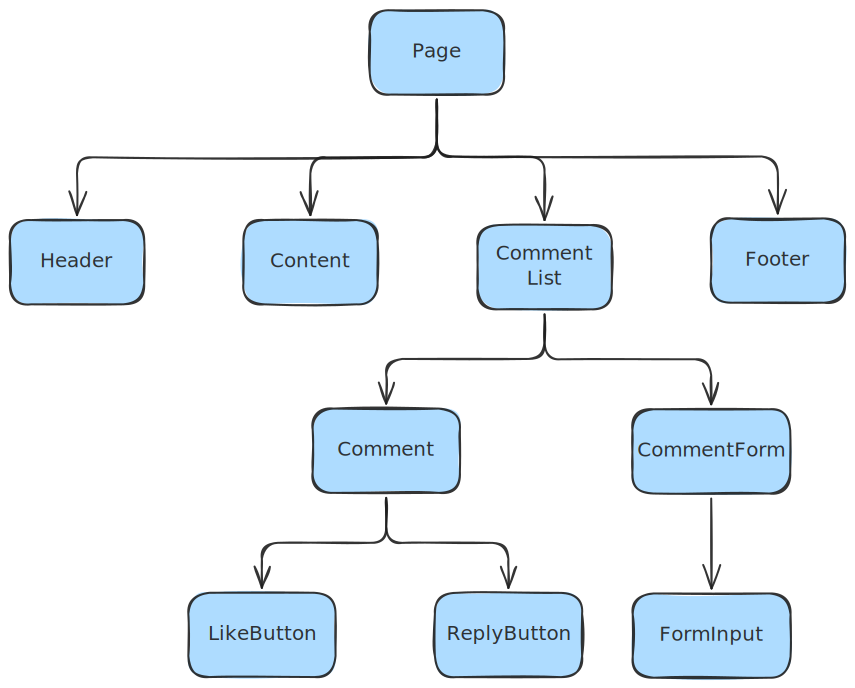
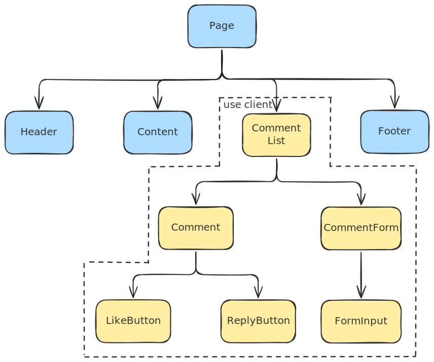

# React Server Components in 2025

Where are we at?

---
layout: full
---

# About me

- Nick Tsim 👋
- AI Engineer @ AbbVie
- 10 years experience
- React enthusiast since 2016

---
layout: full
---

# Agenda

1. What are React server components?
2. How do you use them?
3. Current state and controversy
4. Where are things going?

---
layout: full
---

# A brief history

Before server components

<v-clicks>

<div mb="10">

## 2013: Client-side only

e.g. Vanilla React, React Router

</div>

<div mb="10">

## 2015: Static site generation (SSG)

e.g. Gatsby

</div>

<div mb="10">

## 2018 - 2022: Server-side rendering (SSR)

e.g. Next.js, Remix

</div>

</v-clicks>

---
layout: image
---

# How SSR works



<!--
Hydate the client:
- Where virtual DOM is compared against server HTML
- Event listeners attached to DOM elements
-->

---
layout: full
---

# The SSR problem

Server-side rendering was great, but...

<v-clicks depth="2">

- React renders everything **twice**
  - Once on server and once on client to **hydrate**
- Need to ship the **entire app** to hydrate
  - **Larger bundles** - longer until page is **interactive**
- Data fetching via framework-specific APIs
  - Next's `getServerSideProps`, `getStaticProps`
  - Remix's `loader`

</v-clicks>

---
layout: section
---

# Can we do better?

---
layout: default
---

# Server components to the rescue

<v-clicks depth="2">

- Initial [RFC proposal](https://github.com/reactjs/rfcs/blob/main/text/0188-server-components.md) in **December 2020**
- Implemented by Next.js in **May 2023** ([App Router](https://nextjs.org/docs/app))

Main aims:

- Smaller client bundles
- Automatic code-splitting
- Parallelise data fetching to avoid waterfalls

</v-clicks>

---
layout: section
---

# What do they look like?

---
layout: default
---

# An example

````md magic-move
```jsx
import { useQuery } from "@tanstack/react-query";

function ProfileAvatar() {
  const { data: user } = useQuery({
    queryKey: ["profile"],
    queryFn: () => fetchProfile(),
  });

  return user ? (
    <div>
      <Avatar image={user.image} />
      {user.name}
    </div>
  ) : (
    <AvatarLoading />
  );
}
```

```jsx
function ProfileAvatar() {
  return (
    <div>
      <Avatar image={user.image} />
      {user.name}
    </div>
  );
}
```

```jsx {1,2|*}
async function ProfileAvatar() {
  const user = await fetchProfile();

  return (
    <div>
      <Avatar image={user.image} />
      {user.name}
    </div>
  );
}
```
````

---
layout: default
---

# Caveats

With server components

<v-clicks depth="2">

- Rendered on the **server** or at **build time**
  - No browser APIs
- **No hooks** allowed
  - No state
  - No interactivity
  - No context

</v-clicks>

<v-click>

</v-click>

---
layout: statement
---

# No hooks?!

---
layout: default
---

# Client components

````md magic-move
<!-- prettier-ignore -->
```jsx
function Counter() {
  const [count, setCount] = useState(0);

  return (
    <button onClick={() => setCount(count + 1)}>
      Current count: {count}
    </button>
  );
}
```

<!-- prettier-ignore -->
```jsx
"use client";

function Counter() {
  const [count, setCount] = useState(0);

  return (
    <button onClick={() => setCount(count + 1)}>
      Current count: {count}
    </button>
  );
}
```
````

<v-clicks depth="2">

- `use client` tells the **bundler** to treat the file as a **client module**
  - Shipped to client
- Server components **are not** shipped to client
  - Reduced bundle size

</v-clicks>

<!--
- Can't mix server and client components in the same file
-->

---
layout: full
transition: fade
---



---
layout: full
transition: fade
---



---
layout: statement
---

## Server components are the **default** when enabled

Opt out, not in

---
layout: section
---

# What about the data?

---
layout: default
---

# Data fetching in RSCs

<v-clicks>

- Just use `async` / `await` 😍
- Server components fetch data in parallel - **no waterfalls**
- New(ish) problem - data fetching can be **duplicated**

</v-clicks>

<v-click>

```ts
function getUser(userId) {
  return db.users.get(userId);
}

async function UserAvatar({ userId }) {
  const user = await getUser(userId);
  // ...
}

async function UserInfo({ userId }) {
  const user = await getUser(userId);
  // ...
}
```

</v-click>

---
layout: default
---

# Optimising data fetching

New caching APIs to de-duplicate requests

<v-click>

React 19 `cache` API:

```jsx
import { cache } from "react";
import db from "your-db";

const getUser = cache((userId) => {
  return db.users.get(userId);
});
```

</v-click>

<v-click>

Next.js' extended `fetch` API:

- Memoizes GET / HEAD requests with same URL
- Enabled by **default** (can opt-out)

</v-click>

---
layout: default
---

# Server functions

<v-clicks>

- ⚠️ Not the same as server components ⚠️
- Run **server-side logic** (e.g. saving data) without writing an API 🪄
- Mark server functions with `use server`

</v-clicks>

<v-click>

````md magic-move
```jsx
import api from "your-api";

function Example({ userId }) {
  const handleClick = async () => {
    await api.delete(`/users/${userId}`);
  };

  return <button onClick={handleClick}>Delete user</button>;
}
```

```jsx {*|4-8}
import db from "your-db";

function Example({ userId }) {
  const handleClick = async () => {
    "use server";

    await db.users.delete(userId);
  };

  return <button onClick={handleClick}>Delete user</button>;
}
```
````

</v-click>

<v-clicks>

⚠️ Only allowed in **server components**!

</v-clicks>

---
layout: section
---

# How have things gone?

---
layout: default
---

# The story so far

<v-clicks>

- Next.js' App Router has been stable since 2024
- Only **one** other framework - [Waku](https://waku.gg/)
- Slow adoption by ecosystem and users

</v-clicks>

---
layout: statement
---

# What's going on? 🤔

---
layout: default
---

# The server component tax

<v-clicks>

- It's a **paradigm shift** - need to learn new programming model
- Hard for larger projects to migrate
- Server components aren't needed for every application

</v-clicks>

---
layout: default
---

# Governance and direction

<v-clicks depth="2">

- Some of React's main contributors moved to Vercel
  - Majority still work at Meta
- The React team now recommends using **frameworks** over other options

</v-clicks>

<v-click>

> If you want to build a new app or website with React, we recommend starting with a framework.

— React docs on [Creating a React App](https://react.dev/learn/creating-a-react-app)

</v-click>

<v-click>

Does Vercel have a **conflict of interest**? 🤨

</v-click>

---
layout: default
---

# The origin story

<v-clicks>

- The React team wanted to **standardise** server rendering and data fetching
- They approached Vercel **first** to pitch server components
- Next.js allowed the React team to implement their full vision
- Vercel essentially **rewrote** Next.js to do this

</v-clicks>

---
layout: default
---

# The reality of RSCs

<v-clicks depth="2">

- Implementing server components is **hard**
- Requires **deep knowledge** of bundlers 😵‍💫
- Better when integrated into a framework for **cohesive** experience
- Frameworks aren't a bad thing!
- Client-side rendering isn't going anywhere

</v-clicks>

---
layout: quote
---

> If you use React, you should be using a React framework.
>
> Your React framework of choice should have built-in solutions for data fetching, routing, and server rendering.
> Frameworks don't treat these as independent concerns — they provide deeply integrated solutions that are easy
> to use and result in excellent **performance** out of the box.

— Andrew Clark, core React contributor

---
layout: default
---

# Things to look out for

<v-clicks depth="2">

## Partial pre-rendering (PPR)

- Next.js feature
- Render as much **static** content at **build time**
- Server renders **dynamic** content at **runtime** and streams it to client

## Wider support

- Vite plugin
- Parcel support
- More framework adoption

</v-clicks>

---
layout: default
---

# Should you adopt RSCs?

<v-clicks depth="2">

- Good use cases:
  - Apps where page load performance is critical
  - Apps that don't need a separate backend
  - Static websites
- New projects should **definitely consider** it
  - Unclear benefit for older projects
- Don't need server components to keep using React!

</v-clicks>

---
layout: two-cols
---

# Thanks!

- Slides: https://ntsim.github.io/rscs-in-2025/
- LinkedIn: https://linkedin.com/in/ntsim
- GitHub: https://github.com/ntsim


